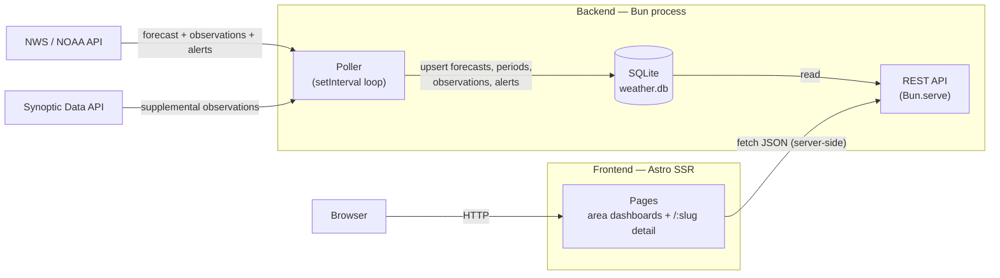
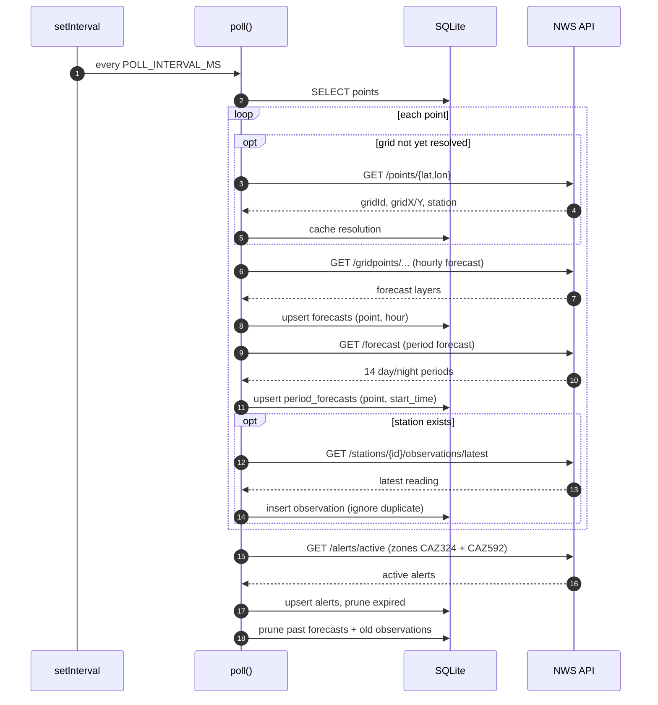
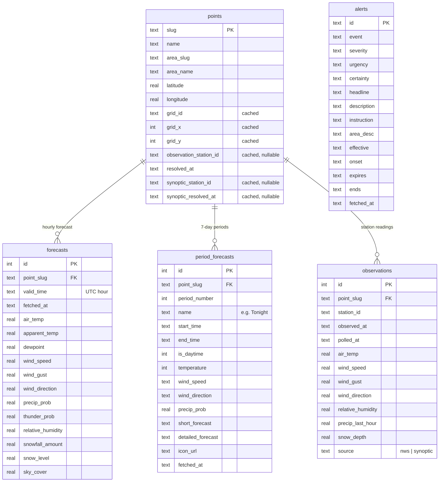

# Yosemite Weather

Full-stack weather app for Yosemite National Park. A Bun backend polls the
[NWS / NOAA API](https://www.weather.gov/documentation/services-web-api) and the
[Synoptic Data (Mesonet) API](https://synopticdata.com) for a set of park locations
and serves the data over a REST API backed by SQLite; an Astro frontend (in
[`web/`](web/)) renders per-area dashboards and per-location detail pages.

For each configured point the backend collects:

- **Forecasts** — NWS gridpoint hourly forecast (temperature, dewpoint, apparent
  temperature, wind, gusts, precip probability, thunder probability, humidity, snowfall,
  snow level, sky cover). Available for every point.
- **Period forecasts** — NWS 7-day outlook broken into 12-hour day/night periods with
  text description, temperature, wind, and condition icon.
- **Observations** — latest measured conditions from the nearest NWS station or
  Synoptic (Mesonet) station, where available.
- **Alerts** — active NWS watches, warnings, and advisories for the Yosemite forecast
  zone (CAZ324) and Central Sierra fire weather zone (CAZ592).

The NWS API is free and requires no token — only a `User-Agent` header identifying
the app and a contact email. The Synoptic free tier requires a token (see
[synopticdata.com](https://synopticdata.com)).

## Architecture

The backend has two independent halves sharing one SQLite database: a **poller**
that writes weather data on an interval, and a **REST API** that reads it. The
Astro frontend is a separate process that fetches from the API server-side.



Both halves start from [`src/index.ts`](src/index.ts): it initializes the schema,
starts the API server, runs an initial poll, then schedules subsequent polls every
`POLL_INTERVAL_MS`. Synoptic observations run on their own longer interval
(`SYNOPTIC_POLL_INTERVAL_MS`, default 60 min).

### The poll cycle

A single `poll()` pass walks every configured point. The first time a point is seen
its NWS grid cell and nearest station are resolved and cached; later polls reuse the
cached resolution. A failure on one point is logged and skipped without aborting the
cycle.



## Setup

```bash
# Install dependencies
bun install

# Copy and configure environment variables
cp .env.example .env
# Edit .env — set CONTACT_EMAIL (required) and SYNOPTIC_API_TOKEN (optional)

# Initialize the database and seed points
bun run db:setup
```

## Running

```bash
# Start API server + polling loop (with hot reload)
bun run dev

# Or without hot reload
bun run start

# Run a one-off poll manually
bun run poll

# Run the test suite
bun test
```

On the first poll, each point is resolved to its NWS forecast grid and nearest
observation station; the resolution is cached in the database so later polls skip it.

Transient NWS failures (5xx, 429, network errors) are retried with exponential
backoff — `NWS_RETRY_MAX_ATTEMPTS` (default 3), `NWS_RETRY_BASE_DELAY_MS` (default
500). A failure on one point is logged and skipped without aborting the cycle.

## API Endpoints

| Endpoint | Description |
|---|---|
| `GET /api/areas` | List all areas and their points |
| `GET /api/overview` | Current-hour forecast + latest observation for every point, grouped by area |
| `GET /api/points/:slug/forecast?hours=24` | Hourly forecast for the next N hours |
| `GET /api/points/:slug/forecast/periods` | NWS 7-day period forecast (12-hour day/night periods) |
| `GET /api/points/:slug/forecast/discussion` | Latest NWS Area Forecast Discussion for the point's office |
| `GET /api/points/:slug/observations/latest` | Most recent observation (if a station is available) |
| `GET /api/alerts` | Active NWS alerts, most severe first |
| `GET /api/data-explorer` | Aggregated DB stats, sample forecast, coverage grid (dev/diagnostic) |
| `GET /health` | Health check with last-poll staleness (see below) |

Units are English: °F, mph, inches, feet, percent, degrees.

### `GET /health`

Reports freshness and coverage. Returns `200` when healthy and `503` when the
data is stale or missing, so it can back an uptime probe. Data is considered
stale when the most recent forecast write is older than twice the poll interval.

```jsonc
{
  "status": "ok",                       // "ok" | "stale" | "no_data"
  "lastPollAt": "2026-05-29T00:01:46.024Z",
  "ageSeconds": 2,
  "staleThresholdSeconds": 1800,
  "points": { "total": 25, "resolved": 25, "withObservations": 25 },
  "forecastRows": 1825,
  "observationRows": 40
}
```

## Data Model

The schema lives in `src/db/index.ts`. Five SQLite tables, all storing English
units. Any numeric weather field may be `null` when NWS has no value for it.



### `points`

One row per monitored location (seeded from `src/config/index.ts` on `db:setup`).
The `grid_*` and `observation_station_id` columns are filled lazily on the first
NWS poll; `synoptic_station_id` is filled on the first Synoptic poll.

| Column | Type | Notes |
|---|---|---|
| `slug` | TEXT, PK | Stable identifier, e.g. `tuolumne-meadows` |
| `name` | TEXT | Display name |
| `area_slug` / `area_name` | TEXT | The region grouping from config |
| `latitude` / `longitude` | REAL | Coordinates polled from NWS |
| `grid_id` | TEXT, nullable | NWS forecast office, e.g. `HNX` (cached) |
| `grid_x` / `grid_y` | INTEGER, nullable | NWS grid cell (cached) |
| `observation_station_id` | TEXT, nullable | Nearest NWS station, e.g. `TUMC1` (cached) |
| `resolved_at` | TEXT, nullable | ISO timestamp of the NWS grid/station lookup |
| `synoptic_station_id` | TEXT, nullable | Nearest Synoptic station (cached) |
| `synoptic_resolved_at` | TEXT, nullable | ISO timestamp of the Synoptic station lookup |

### `forecasts`

Hourly NWS gridpoint forecast. One row per `(point, hour)`. Polling **upserts** on
`(point_slug, valid_time)` because NWS revises forecasts. Retention horizon is
`FORECAST_HOURS` (default 72).

| Column | Type | Unit |
|---|---|---|
| `id` | INTEGER, PK | — |
| `point_slug` | TEXT, FK → `points.slug` | — |
| `valid_time` | TEXT | ISO 8601 hour the forecast is for (UTC) |
| `fetched_at` | TEXT | ISO timestamp the row was last written |
| `air_temp` | REAL | °F |
| `apparent_temp` | REAL | °F (heat index / wind chill) |
| `dewpoint` | REAL | °F |
| `wind_speed` / `wind_gust` | REAL | mph |
| `wind_direction` | REAL | degrees |
| `precip_prob` | REAL | % |
| `thunder_prob` | REAL | % |
| `relative_humidity` | REAL | % |
| `snowfall_amount` | REAL | inches (this hour) |
| `snow_level` | REAL | feet |
| `sky_cover` | REAL | % |

Unique: `(point_slug, valid_time)`.

### `period_forecasts`

NWS 7-day outlook in 12-hour day/night periods. One row per `(point, start_time)`.
Polling upserts on each cycle; expired periods (past `end_time`) are pruned
automatically.

| Column | Type | Notes |
|---|---|---|
| `id` | INTEGER, PK | — |
| `point_slug` | TEXT, FK → `points.slug` | — |
| `period_number` | INTEGER | NWS sequence number |
| `name` | TEXT | e.g. `Tonight`, `Saturday` |
| `start_time` / `end_time` | TEXT | ISO 8601 |
| `is_daytime` | INTEGER | 1 = day, 0 = night |
| `temperature` | INTEGER | °F |
| `wind_speed` | TEXT | NWS text, e.g. `10 to 15 mph` |
| `wind_direction` | TEXT | NWS compass, e.g. `NW` |
| `precip_prob` | REAL | % |
| `short_forecast` | TEXT | e.g. `Mostly Cloudy` |
| `detailed_forecast` | TEXT | Full NWS paragraph |
| `icon_url` | TEXT | NWS icon URL (slug mapped to weather-icons font) |

Unique: `(point_slug, start_time)`.

### `observations`

Latest measured conditions from a point's nearest station. One row per
`(point, observation timestamp)`; polling inserts with `ON CONFLICT DO NOTHING`.
Multiple points can share a station (e.g. several Tuolumne-area points use `TUMC1`).

| Column | Type | Unit |
|---|---|---|
| `id` | INTEGER, PK | — |
| `point_slug` | TEXT, FK → `points.slug` | — |
| `station_id` | TEXT | Station that produced the reading |
| `observed_at` | TEXT | ISO timestamp from the station |
| `polled_at` | TEXT | ISO timestamp we fetched it |
| `air_temp` | REAL | °F |
| `wind_speed` / `wind_gust` | REAL | mph |
| `wind_direction` | REAL | degrees |
| `relative_humidity` | REAL | % |
| `precip_last_hour` | REAL | inches |
| `snow_depth` | REAL | inches (nullable) |
| `source` | TEXT | `nws` or `synoptic` |

Unique: `(point_slug, observed_at)`.

### `alerts`

Active NWS alerts covering the configured zones. One row per NWS alert ID; upserted
on each poll so headline and description stay current. Expired alerts
(`COALESCE(ends, expires) < now`) are pruned at the end of every poll cycle.

| Column | Type | Notes |
|---|---|---|
| `id` | TEXT, PK | NWS alert identifier |
| `event` | TEXT | e.g. `Red Flag Warning` |
| `severity` | TEXT | `Extreme`, `Severe`, `Moderate`, `Minor` |
| `urgency` / `certainty` | TEXT | NWS urgency/certainty fields |
| `headline` | TEXT | Short description |
| `description` | TEXT | Full alert text |
| `instruction` | TEXT | Safety actions, nullable |
| `area_desc` | TEXT | Affected area description |
| `effective` / `onset` / `expires` / `ends` | TEXT | ISO 8601 timestamps |

### Retention

At the end of every poll cycle, old data is pruned to keep all tables bounded:

- **Forecasts** — rows whose `valid_time` is in the past are deleted.
- **Period forecasts** — rows whose `end_time` is in the past are deleted.
- **Observations** — rows older than `OBSERVATION_RETENTION_DAYS` (default 30) are deleted.
- **Alerts** — rows where `COALESCE(ends, expires)` is in the past are deleted.

### API response shapes

`GET /api/areas` returns the config as-is: an array of areas, each with a `points`
array of `{ slug, name, latitude, longitude }`.

`GET /api/overview` groups points by area and pairs each with its current data:

```jsonc
[
  {
    "slug": "high-country",
    "name": "High Country (Tuolumne & Tioga)",
    "points": [
      {
        "slug": "tuolumne-meadows",
        "name": "Tuolumne Meadows",
        "forecast":    { /* forecast row for the current hour, or null */ },
        "observation": { /* latest observations row, or null */ }
      }
    ]
  }
]
```

`GET /api/points/:slug/forecast?hours=N` returns an array of forecast rows (the
table columns above, minus `id`/`point_slug`/`fetched_at`) from now through N hours.

`GET /api/points/:slug/forecast/periods` returns an array of future period rows
(columns above, minus `id`/`point_slug`/`fetched_at`), ordered by `start_time`.

`GET /api/points/:slug/observations/latest` returns a single observations row, or
`404` if the point has no station / no readings yet.

`GET /api/alerts` returns an array of active alert rows ordered by severity
(`Extreme` first), then `onset`.

## Configuration

Points and areas are defined in `src/config/index.ts`. Each point is a name +
latitude/longitude; edit the `areas` array to add or regroup locations. Coordinates
for the default Yosemite set come from `locations.md`.

## Frontend

An [Astro](https://astro.build) app in [`web/`](web/), running in SSR (`output: 'server'`)
mode with [Tailwind CSS v4](https://tailwindcss.com) via the `@tailwindcss/vite` plugin.
Data is fetched **server-side** in each page's frontmatter, so pages render as plain
HTML with no client-side data fetching required.

Weather condition icons use the [weather-icons](https://erikflowers.github.io/weather-icons/)
font package. NWS icon URL slugs (e.g. `few`, `tsra`, `bkn`) are mapped to the
appropriate `wi-day-*` / `wi-night-*` class in `web/src/lib/nwsIcons.ts`. Sun and
moon data (rise/set times, phase, illumination) is computed server-side via
[suncalc](https://github.com/mourner/suncalc).

### Charts

All charts are rendered with [D3](https://d3js.org) on a shared helper module,
[`web/src/lib/d3chart.ts`](web/src/lib/d3chart.ts) (palette, unit helpers, path
generators, axes, day/night shading, and the cross-panel hover). The headline chart is
the **hourly Meteogram** on the area dashboards' "Hourly" tab
([`MeteogramD3.astro`](web/src/components/MeteogramD3.astro)): an NWS-style 5-panel graph
(temperature / dewpoint / feels-like, surface wind + gust + direction, sky cover,
precipitation potential + thunder, relative humidity) drawn as one stacked SVG with
day/night shading from sunrise/sunset, a "now" marker, reference lines (freezing,
fire-weather dry-air), and a synced cross-panel hover. The location-detail temp/precip
chart, the multi-year snowpack SWE chart, and the data-explorer panels all build on the
same module.

> The project previously used Chart.js; it was fully migrated to D3 and the dependency
> removed. See [`docs/d3-migration.md`](docs/d3-migration.md) for the migration record.

### Pages

| Route | File | Shows |
|---|---|---|
| `/` | `src/pages/index.astro` | Valley & West area dashboard |
| `/areas/:slug` | `src/pages/areas/[area].astro` | South or High Country area dashboard |
| `/:slug` | `src/pages/[slug].astro` | Location detail — current conditions, 7-day periods, 72h chart |
| `/snowpack` | `src/pages/snowpack.astro` | NRCS SNOTEL station SWE — multi-year water-year comparison charts (CDEC data) |
| `/data` | `src/pages/data.astro` | Data explorer — D3 panels for all DB variables, coverage grid |

Each area dashboard shows: a summary card (representative-point conditions), a tabbed
forecast (7-day periods, an hourly graph, and the D3/Chart.js Meteograms), a
deduplicated current-conditions table grouped by NWS station, and a Sun & Moon card.
The homepage (`/`) renders the Valley & West dashboard directly; South and High Country
live at `/areas/south` and `/areas/high-country`.

An `AlertsBanner` component renders collapsible, severity-coded alert cards below
the nav on every page. It renders nothing when no alerts are active.

The typed API client lives in `web/src/lib/api.ts`. The backend base URL defaults to
`http://localhost:3000` and can be overridden with the `API_BASE` environment variable.

### Running the frontend

```bash
cd web
bun install
bun run dev          # Astro dev server on http://localhost:4321
```

The backend API must be running (`bun run dev` from the repo root) for the frontend
to load data. Other scripts: `bun run build` (production build), `bun run check`
(type-check `.astro` + `.ts`).

## Project Structure

```
.
├── docs/
│   └── d3-migration.md     # Chart.js → D3 charting migration roadmap
├── src/                    # Backend (Bun)
│   ├── index.ts            # Entry point — starts API + polling loop
│   ├── config/
│   │   └── index.ts        # Env vars, point/area definitions
│   ├── api/
│   │   ├── server.ts       # Bun.serve HTTP server
│   │   └── routes.ts       # Route handlers
│   ├── db/
│   │   ├── index.ts        # Connection, schema, point seeding
│   │   └── setup.ts        # DB initialization script
│   ├── nws/
│   │   └── client.ts       # NWS API client (resolve, forecast, observations, alerts)
│   ├── synoptic/
│   │   └── client.ts       # Synoptic Data API client (station discovery + observations)
│   └── poller/
│       ├── index.ts        # Poll cycle — NWS + Synoptic + alerts
│       └── poll.ts         # Standalone poll script
└── web/                    # Frontend (Astro + Tailwind)
    ├── astro.config.mjs    # SSR output + Tailwind Vite plugin
    └── src/
        ├── components/
        │   ├── AlertsBanner.astro   # Severity-coded NWS alert cards
        │   ├── ForecastTabs.astro   # 7-Day / Hourly tab shell (Hourly = D3 meteogram)
        │   ├── MeteogramD3.astro    # D3 5-panel hourly meteogram (single stacked SVG)
        │   ├── ForecastChart.astro  # D3 temp + precip chart (detail page)
        │   ├── ObsTable.astro       # Current conditions table (deduplicated by station)
        │   ├── PeriodForecast.astro # 7-day day/night period table with weather icons
        │   ├── SummaryCard.astro    # Area summary: conditions, NWS worded forecast, sun/moon, forecast discussion
        │   ├── SWECard.astro        # Single-station SWE chart (embeddable, compact mode)
        │   ├── SWEChart.astro       # D3 multi-year water-year SWE line chart
        │   └── SWEStationTabs.astro # Tabbed SWE view across all SNOTEL stations
        ├── layouts/
        │   └── Layout.astro         # Page shell + sticky nav + alerts banner
        ├── lib/
        │   ├── api.ts               # Typed backend API client
        │   ├── d3chart.ts           # Shared D3 charting helpers (palette, axes, hover, units)
        │   ├── holidays.ts          # US holiday lookup utility
        │   ├── nwsIcons.ts          # NWS icon slug → weather-icons class mapping
        │   └── sunMoon.ts           # suncalc wrappers for sun/moon data
        ├── pages/
        │   ├── index.astro          # Valley & West area dashboard
        │   ├── [slug].astro         # Location detail page
        │   ├── areas/[area].astro   # Area dashboards (South, High Country)
        │   ├── snowpack.astro       # Yosemite snowpack — multi-year SWE charts
        │   └── data.astro           # Data explorer / diagnostics
        └── styles/
            └── global.css           # @import "tailwindcss" + weather-icons
```

## Frontend Roadmap

Target: feature parity with backcountry weather dashboards like
[ccweather.com](https://www.ccweather.com) (Steve's Cottonwood Canyon dashboard),
adapted for Yosemite. Milestones are ordered roughly by priority; checked items ship.

### ✅ Completed

#### Milestone 1 — Dashboard foundation

- [x] Astro SSR app with Tailwind v4, dark theme, responsive layout, sticky nav
- [x] Per-area dashboards (Valley & West as homepage, South and High Country at `/areas/:slug`)
- [x] Current conditions table grouped by unique NWS observation station per area
- [x] Per-point summary: color-coded temperature, wind speed + direction, precip %
- [x] Snowfall indicator on points expecting snow
- [x] Typed API client against the backend

#### Milestone 2 — Location detail & forecast chart

- [x] Current-conditions panel — station observation with forecast fallback
      (temp, wind + gust + direction, humidity, precip, source station)
- [x] 72-hour hourly forecast table (temp, wind, precip %, sky %, RH %, snow)
- [x] Temperature + precipitation chart (Chart.js, dual-axis, hover tooltip)

#### Milestone 3 — Richer forecast UI

- [x] Weather condition icons — NWS icon slugs mapped to weather-icons font (`wi-day-*` / `wi-night-*`) with semantic Tailwind colors
- [x] 7-day extended forecast — 12-hour day/night periods from NWS `/forecast` endpoint with weather icons, color-coded temperature, wind direction icons, and precip _(ccweather: 7-day forecast)_
- [x] 7-day period forecast on area overview pages
- [x] Hourly Meteogram — NWS-style 5-panel graph (temp/dewpoint/feels-like, wind + gust + direction, sky cover, precip + thunder, humidity) with day/night shading, "now" marker, freezing & dry-air reference lines, and synced cross-panel hover. Built in both D3 (`MeteogramD3`) and Chart.js (`Meteogram`) _(ccweather: hourly graph)_

#### Milestone 4 — Alerts & conditions

- [x] NWS active alerts (watches / warnings / advisories) banner — weather zone CAZ324 + fire weather zone CAZ592 _(ccweather: alerts)_
- [x] Sunrise / sunset & moon phase per area — sun times, day length, moon phase icon + illumination, rise/set times, next-phase countdown

### 🔜 Planned

#### Milestone 3 — Richer forecast UI (continued)

- [ ] Timeframe tabs on the detail page (24h / 48h / 72h) _(ccweather: tabbed forecast nav)_
- [x] Additional chart series — wind & gusts, humidity, sky cover delivered by the hourly Meteogram (snow level still pending)
- [x] Wind direction indicators — rotated arrows + compass labels in the Meteogram wind panel
- [x] Unit toggle (°F/°C, mph/km/h, in/mm) — client-side toggle in nav, persisted in localStorage
- [x] Migrate charting from Chart.js to D3 — all charts (meteogram, detail chart, SWE, data explorer) ported to a shared D3 module; `chart.js` removed. See [`docs/d3-migration.md`](docs/d3-migration.md)
- [ ] WBGT (wet bulb globe temperature / heat stress) indicator on detail page — available from NWS raw gridpoint

#### Milestone 5 — Snow & avalanche

- [ ] Snowfall accumulation display + snow-level line on the chart _(ccweather: new-snow estimates)_
- [ ] Snow depth with 12 / 24 / 48-hour change _(ccweather: snow depth + deltas)_ — needs SNOTEL data
- [ ] 30-day snow-depth trend chart _(ccweather: 30-day trends)_
- [x] Snow Water Equivalent multi-season comparison _(ccweather: SWE graphs)_ — CDEC SNOTEL data via `/snowpack`
- [ ] Avalanche forecast links (e.g. Eastern Sierra Avalanche Center) _(ccweather: avalanche section)_

#### Milestone 6 — Maps & imagery

- [ ] Interactive map of monitored points (Leaflet/MapLibre) with click-through to detail
- [ ] NOAA radar layer / embed _(ccweather: interactive radar)_
- [ ] NPS Yosemite webcams _(ccweather: webcam feeds)_

#### Milestone 7 — Alerts & conditions (continued)

- [ ] Fire weather text products — daily FWF narrative from NWS Hanford office (HNX)
- [ ] Multi-location observation comparison table — Valley / Tuolumne / Wawona stations side-by-side
- [ ] NWS hourly forecast enrichment — apparent temperature, WBGT from raw gridpoint
- [ ] Road status & closures (Tioga / Glacier Point roads via NPS) _(ccweather: road alerts)_

#### Milestone 8 — Polish & platform

- [ ] Location search / filter
- [ ] Favorites / saved locations (localStorage)
- [ ] Auto-refresh / live updates without full reload
- [ ] Historical observation trends (the backend already retains 30 days)
- [ ] PWA — installable, offline app shell
- [ ] Accessibility pass (keyboard nav, contrast, ARIA)

## Backend Roadmap

- [*] Synoptic Data API integration for wind/obs data not available through NWS. (Built, but waiting on Synoptic.)
- [x] NWS active-alerts polling + passthrough endpoint (weather zone CAZ324 + fire weather zone CAZ592).
- [x] 7-day period forecast polling + endpoint (`GET /api/points/:slug/forecast/periods`).
- [ ] SNOTEL ingestion — snow depth & snow water equivalent (feeds Milestone 4).
- [x] Apparent temperature (feels-like), dewpoint, and thunder probability from the NWS raw gridpoint — added to the `forecasts` table.
- [ ] WBGT field ingestion from NWS raw gridpoint — extend forecasts table.
- [ ] Fire weather text product ingestion — FWF/AFD from NWS `/products` endpoint.
