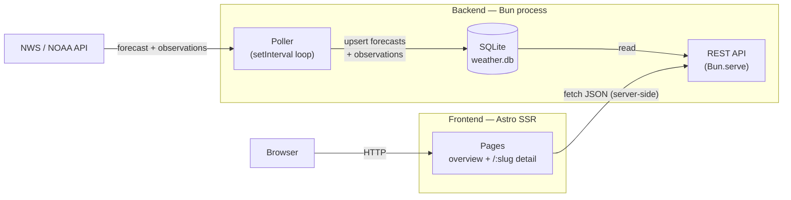
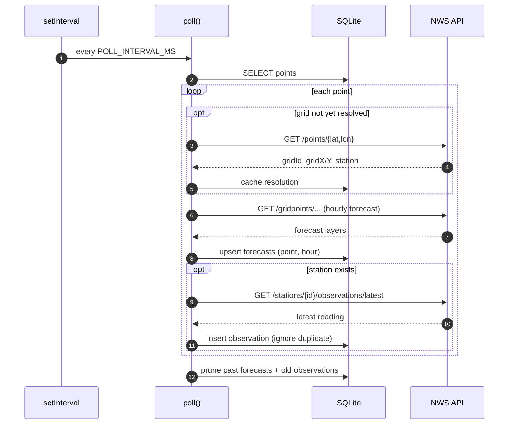
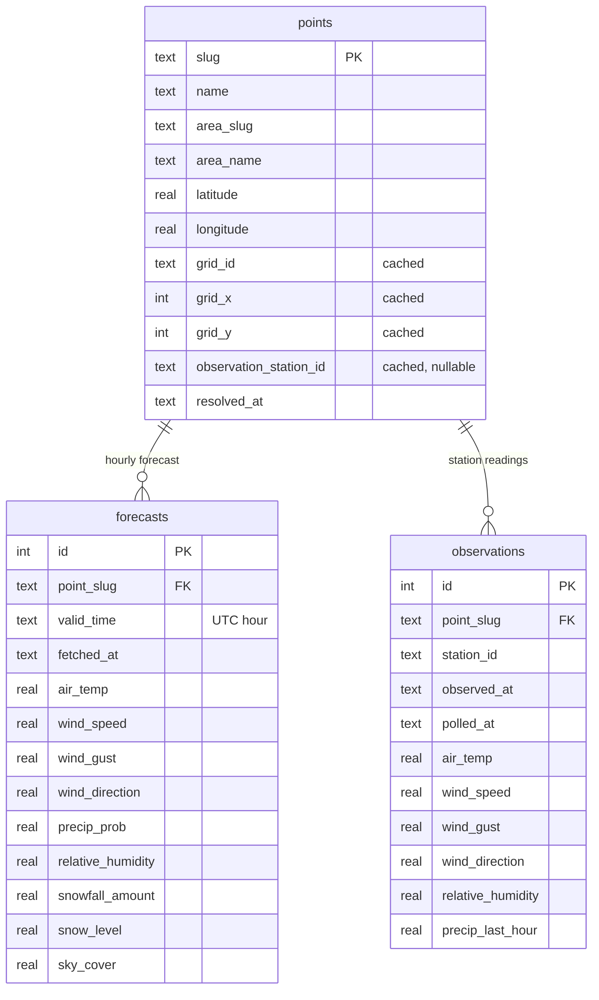
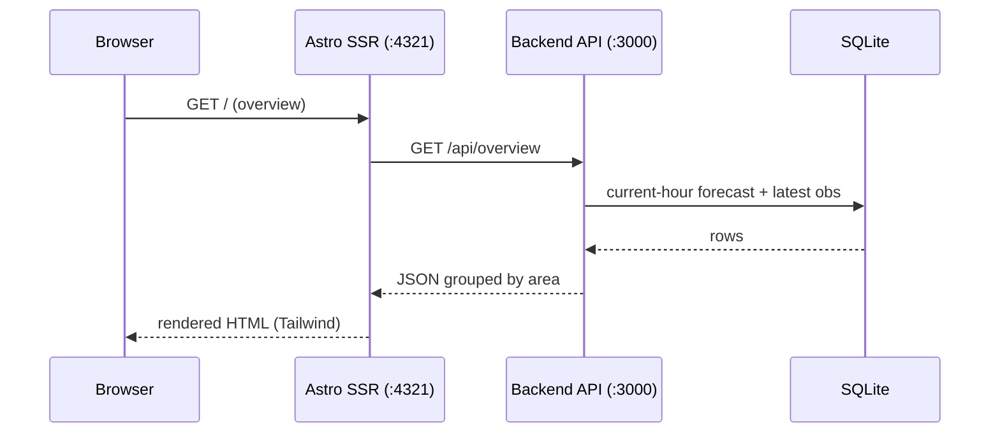

# Yosemite Weather

Full-stack weather app for Yosemite National Park. A Bun backend polls the
[NWS / NOAA API](https://www.weather.gov/documentation/services-web-api) for a set
of park locations and serves the data over a REST API backed by SQLite; an Astro
frontend (in [`web/`](web/)) renders an overview and per-location detail pages.

For each configured point the backend collects:

- **Forecasts** — NWS gridpoint hourly forecast (temperature, wind, gusts, precip
  probability, humidity, snowfall, snow level, sky cover). Available for every point.
- **Observations** — latest measured conditions from the nearest NWS station,
  where one exists (many backcountry points have a nearby RAWS station).

The NWS API is free and requires no token — only a `User-Agent` header identifying
the app and a contact email.

## Architecture

The backend has two independent halves sharing one SQLite database: a **poller**
that writes weather data on an interval, and a **REST API** that reads it. The
Astro frontend is a separate process that fetches from the API server-side.



Both halves start from [`src/index.ts`](src/index.ts): it initializes the schema,
starts the API server, runs an initial poll, then schedules subsequent polls every
`POLL_INTERVAL_MS`.

### The poll cycle

A single `poll()` pass walks every configured point. The first time a point is seen
its NWS grid cell and nearest station are resolved and cached; later polls reuse the
cached resolution. A failure on one point is logged and skipped without aborting the
cycle.



## Setup

```bash
# Install dependencies
bun install

# Copy and configure environment variables
cp .env.example .env
# Edit .env and set CONTACT_EMAIL (used in the NWS User-Agent)

# Initialize the database and seed points
bun run db:setup
```

## Running

```bash
# Start API server + polling loop (with hot reload)
bun run dev

# Or without hot reload
bun run start

# Run a one-off poll manually
bun run poll

# Run the test suite
bun test
```

On the first poll, each point is resolved to its NWS forecast grid and nearest
observation station; the resolution is cached in the database so later polls skip it.

Transient NWS failures (5xx, 429, network errors) are retried with exponential
backoff — `NWS_RETRY_MAX_ATTEMPTS` (default 3), `NWS_RETRY_BASE_DELAY_MS` (default
500). A failure on one point is logged and skipped without aborting the cycle.

## API Endpoints

| Endpoint | Description |
|---|---|
| `GET /api/areas` | List all areas and their points |
| `GET /api/overview` | Current-hour forecast + latest observation for every point, grouped by area |
| `GET /api/points/:slug/forecast?hours=24` | Hourly forecast for the next N hours |
| `GET /api/points/:slug/observations/latest` | Most recent observation (if a station is available) |
| `GET /health` | Health check with last-poll staleness (see below) |

Units are English: °F, mph, inches, feet, percent, degrees.

### `GET /health`

Reports freshness and coverage. Returns `200` when healthy and `503` when the
data is stale or missing, so it can back an uptime probe. Data is considered
stale when the most recent forecast write is older than twice the poll interval.

```jsonc
{
  "status": "ok",                       // "ok" | "stale" | "no_data"
  "lastPollAt": "2026-05-29T00:01:46.024Z",
  "ageSeconds": 2,
  "staleThresholdSeconds": 1800,
  "points": { "total": 25, "resolved": 25, "withObservations": 25 },
  "forecastRows": 1825,
  "observationRows": 40
}
```

## Data Model

The schema lives in `src/db/index.ts`. Three SQLite tables, all storing English
units. Any numeric weather field may be `null` when NWS has no value for it.



### `points`

One row per monitored location (seeded from `src/config/index.ts` on `db:setup`).
The `grid_*` and `observation_station_id` columns are filled lazily on the first
poll — each point is resolved to its NWS forecast grid and nearest station once,
then cached so later polls skip the lookup.

| Column | Type | Notes |
|---|---|---|
| `slug` | TEXT, PK | Stable identifier, e.g. `tuolumne-meadows` |
| `name` | TEXT | Display name |
| `area_slug` / `area_name` | TEXT | The region grouping from config |
| `latitude` / `longitude` | REAL | Coordinates polled from NWS |
| `grid_id` | TEXT, nullable | NWS forecast office, e.g. `HNX` (cached) |
| `grid_x` / `grid_y` | INTEGER, nullable | NWS grid cell (cached) |
| `observation_station_id` | TEXT, nullable | Nearest station, e.g. `TUMC1` (cached; `null` if none) |
| `resolved_at` | TEXT, nullable | ISO timestamp of the grid/station lookup |

### `forecasts`

Hourly NWS gridpoint forecast. One row per `(point, hour)`. Polling **upserts** on
`(point_slug, valid_time)` because NWS revises forecasts — re-polling overwrites a
given hour with the newest values. Retention horizon is `FORECAST_HOURS` (default 72).

| Column | Type | Unit |
|---|---|---|
| `id` | INTEGER, PK | — |
| `point_slug` | TEXT, FK → `points.slug` | — |
| `valid_time` | TEXT | ISO 8601 hour the forecast is for (UTC) |
| `fetched_at` | TEXT | ISO timestamp the row was last written |
| `air_temp` | REAL | °F |
| `wind_speed` / `wind_gust` | REAL | mph |
| `wind_direction` | REAL | degrees |
| `precip_prob` | REAL | % |
| `relative_humidity` | REAL | % |
| `snowfall_amount` | REAL | inches (this hour) |
| `snow_level` | REAL | feet |
| `sky_cover` | REAL | % |

Unique: `(point_slug, valid_time)`.

### `observations`

Latest measured conditions from a point's nearest NWS station. One row per
`(point, observation timestamp)`; polling inserts with `ON CONFLICT DO NOTHING`,
so a row only appears when the station publishes a new reading (roughly hourly).
Multiple points can share a station (e.g. several Tuolumne-area points use `TUMC1`),
in which case each point gets its own row referencing the same `station_id`.

| Column | Type | Unit |
|---|---|---|
| `id` | INTEGER, PK | — |
| `point_slug` | TEXT, FK → `points.slug` | — |
| `station_id` | TEXT | NWS station that produced the reading |
| `observed_at` | TEXT | ISO timestamp from the station |
| `polled_at` | TEXT | ISO timestamp we fetched it |
| `air_temp` | REAL | °F |
| `wind_speed` / `wind_gust` | REAL | mph |
| `wind_direction` | REAL | degrees |
| `relative_humidity` | REAL | % |
| `precip_last_hour` | REAL | inches |

Unique: `(point_slug, observed_at)`.

### Retention

At the end of every poll cycle, old data is pruned to keep both tables bounded:

- **Forecasts** — rows whose `valid_time` is now in the past are deleted (the
  forward horizon is already capped by `FORECAST_HOURS`).
- **Observations** — rows older than `OBSERVATION_RETENTION_DAYS` (default 30) are deleted.

### API response shapes

`GET /api/areas` returns the config as-is: an array of areas, each with a `points`
array of `{ slug, name, latitude, longitude }`.

`GET /api/overview` groups points by area and pairs each with its current data:

```jsonc
[
  {
    "slug": "high-country",
    "name": "High Country (Tuolumne & Tioga)",
    "points": [
      {
        "slug": "tuolumne-meadows",
        "name": "Tuolumne Meadows",
        "forecast":    { /* forecast row for the current hour, or null */ },
        "observation": { /* latest observations row, or null */ }
      }
    ]
  }
]
```

`GET /api/points/:slug/forecast?hours=N` returns an array of forecast rows (the
table columns above, minus `id`/`point_slug`/`fetched_at`) from now through N hours.

`GET /api/points/:slug/observations/latest` returns a single observations row, or
`404` if the point has no station / no readings yet.

## Configuration

Points and areas are defined in `src/config/index.ts`. Each point is a name +
latitude/longitude; edit the `areas` array to add or regroup locations. Coordinates
for the default Yosemite set come from `locations.md`.

## Frontend

An [Astro](https://astro.build) app in [`web/`](web/), running in SSR (`output: 'server'`)
mode with [Tailwind CSS v4](https://tailwindcss.com) via the `@tailwindcss/vite` plugin.
Data is fetched **server-side** in each page's frontmatter, so pages render as plain
HTML with no client-side data fetching required.



### Pages

| Route | File | Shows |
|---|---|---|
| `/` | `src/pages/index.astro` | Overview grid — every point grouped by area, temperature color-coded, with wind and precip |
| `/:slug` | `src/pages/[slug].astro` | Location detail — current conditions panel + 72-hour forecast table |

The typed API client lives in `web/src/lib/api.ts`. The backend base URL defaults to
`http://localhost:3000` and can be overridden with the `API_BASE` environment variable.

### Running the frontend

```bash
cd web
bun install
bun run dev          # Astro dev server on http://localhost:4321
```

The backend API must be running (`bun run dev` from the repo root) for the frontend
to load data. Other scripts: `bun run build` (production build), `bun run check`
(type-check `.astro` + `.ts`).

## Project Structure

```
.
├── src/                    # Backend (Bun)
│   ├── index.ts            # Entry point — starts API + polling loop
│   ├── config/
│   │   └── index.ts        # Env vars, point/area definitions
│   ├── api/
│   │   ├── server.ts       # Bun.serve HTTP server
│   │   └── routes.ts       # Route handlers
│   ├── db/
│   │   ├── index.ts        # Connection, schema, point seeding
│   │   └── setup.ts        # DB initialization script
│   ├── nws/
│   │   └── client.ts       # NWS API client (resolve, forecast, observations)
│   └── poller/
│       ├── index.ts        # Poll cycle — fetch + write to DB
│       └── poll.ts         # Standalone poll script
└── web/                    # Frontend (Astro + Tailwind)
    ├── astro.config.mjs    # SSR output + Tailwind Vite plugin
    └── src/
        ├── components/     # ForecastChart.astro — Chart.js island
        ├── layouts/        # Layout.astro — page shell + nav
        ├── lib/api.ts      # Typed backend API client
        ├── pages/          # index.astro (overview), [slug].astro (detail)
        └── styles/         # global.css (@import "tailwindcss")
```

## Frontend Roadmap

Target: feature parity with backcountry weather dashboards like
[ccweather.com](https://www.ccweather.com) (Steve's Cottonwood Canyon dashboard),
adapted for Yosemite. Milestones are ordered roughly by priority; checked items ship.

### ✅ Completed

#### Milestone 1 — Dashboard foundation

- [x] Astro SSR app with Tailwind v4, dark theme, responsive layout, sticky nav
- [x] Area-grouped overview grid (Valley & West, South, High Country)
- [x] Per-point summary: color-coded temperature, wind speed + direction, precip %
- [x] Snowfall indicator on points expecting snow
- [x] Typed API client against the backend

#### Milestone 2 — Location detail & forecast chart

- [x] Current-conditions panel — station observation with forecast fallback
      (temp, wind + gust + direction, humidity, precip, source station)
- [x] 72-hour hourly forecast table (temp, wind, precip %, sky %, RH %, snow)
- [x] Temperature + precipitation chart (Chart.js, dual-axis, hover tooltip)

### 🔜 Planned

#### Milestone 3 — Richer forecast UI

- [ ] Weather condition icons derived from sky cover / precip type _(ccweather: weather icons)_
- [x] 7-day extended forecast — 12-hour day/night periods from NWS `/forecast` endpoint with NWS icons, color-coded temperature, wind, and precip _(ccweather: 7-day forecast)_
- [ ] Timeframe tabs on the detail page (24h / 48h / 72h) _(ccweather: tabbed forecast nav)_
- [ ] Additional chart series — wind & gusts, humidity, sky cover, snow level (toggleable)
- [ ] Wind direction compass / barbs
- [ ] Unit toggle (°F/°C, mph/kph, in/cm)
- [ ] WBGT (wet bulb globe temperature / heat stress) indicator on detail page — available from NWS raw gridpoint

#### Milestone 4 — Snow & avalanche

- [ ] Snowfall accumulation display + snow-level line on the chart _(ccweather: new-snow estimates)_
- [ ] Snow depth with 12 / 24 / 48-hour change _(ccweather: snow depth + deltas)_ — needs SNOTEL data
- [ ] 30-day snow-depth trend chart _(ccweather: 30-day trends)_
- [ ] Snow Water Equivalent multi-season comparison _(ccweather: SWE graphs)_ — needs SNOTEL data
- [ ] Avalanche forecast links (e.g. Eastern Sierra Avalanche Center) _(ccweather: avalanche section)_

#### Milestone 5 — Maps & imagery

- [ ] Interactive map of monitored points (Leaflet/MapLibre) with click-through to detail
- [ ] NOAA radar layer / embed _(ccweather: interactive radar)_
- [ ] NPS Yosemite webcams _(ccweather: webcam feeds)_

#### Milestone 6 — Alerts & conditions

- [x] NWS active alerts (watches / warnings / advisories) banner — weather zone CAZ324 + fire weather zone CAZ592 _(ccweather: alerts)_
- [ ] Fire weather text products — daily FWF narrative from NWS Hanford office (HNX)
- [ ] Multi-location observation comparison table — Valley / Tuolumne / Wawona stations side-by-side
- [ ] NWS hourly forecast enrichment — apparent temperature, WBGT from raw gridpoint
- [ ] Road status & closures (Tioga / Glacier Point roads via NPS) _(ccweather: road alerts)_
- [ ] Sunrise / sunset & moon phase per location

#### Milestone 7 — Polish & platform

- [ ] Location search / filter
- [ ] Favorites / saved locations (localStorage)
- [ ] Auto-refresh / live updates without full reload
- [ ] Historical observation trends (the backend already retains 30 days)
- [ ] PWA — installable, offline app shell
- [ ] Accessibility pass (keyboard nav, contrast, ARIA)

## Backend Roadmap

- [x] Synoptic Data API integration for wind/obs data not available through NWS.
- [x] NWS active-alerts polling + passthrough endpoint (weather zone CAZ324 + fire weather zone CAZ592).
- [ ] SNOTEL ingestion — snow depth & snow water equivalent (feeds Milestone 4).
- [ ] Daily forecast aggregation endpoint for the 7-day cards (feeds Milestone 3).
- [ ] WBGT field ingestion from NWS raw gridpoint — extend forecasts table.
- [ ] Fire weather text product ingestion — FWF/AFD from NWS `/products` endpoint.
- [ ] Apparent temperature (feels-like) from NWS raw gridpoint — extend forecasts table.
